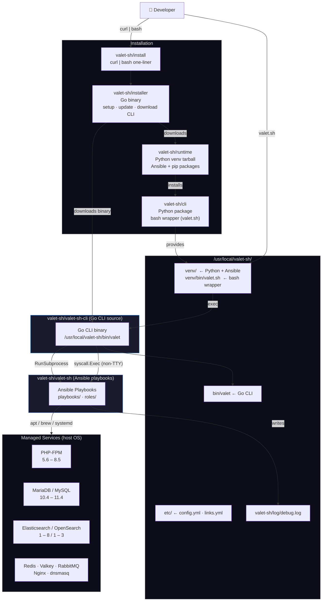
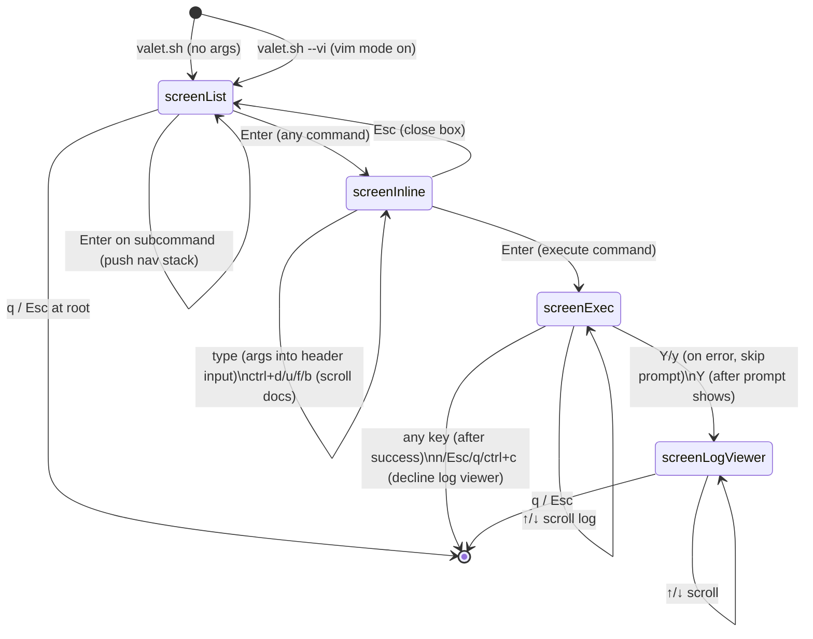
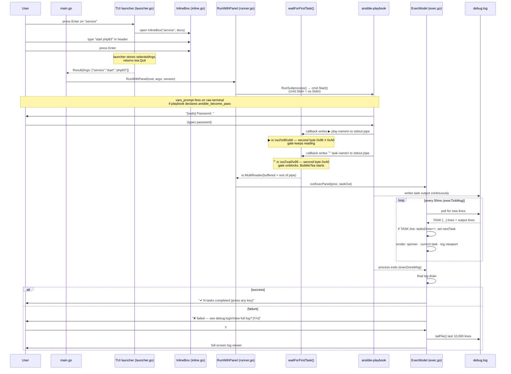

# valet-sh Architecture

## System Overview

How the repositories work together to deliver a working installation on a developer machine.



---

## TUI State Machine

How the interactive launcher transitions between states.



---

## Execution Flow

What happens when a command runs, from user input to Ansible output.



---

## Colour Palette

All colours use terminal palette indices so the TUI adapts to the user's terminal theme.

| Index | Name | Role in TUI |
|---|---|---|
| `12` | Bright blue | Headers (`▶ valet.sh`), filter prompt, section titles |
| `10` | Bright green | Selected command (`▶`), spinner, task counter, `✔ done` |
| `9` | Bright red | `✘ failed`, error messages |
| `8` | Bright black (dim) | Ghost text, separators `·`, dim hints, unselected commands |
| `7` | Normal foreground | Regular list items, input text, log content |

These indices match the ANSI codes used by the Ansible Python callback plugin
(`plugins/callback/valet-sh.py`) so the TUI and Ansible output feel visually consistent.

---

## CLI Task Display: Real-Time Streaming from Ansible stdout

### Problem Solved

The CLI execution panel needed to display **current Ansible task names in real time** as Ansible moves from task to task, without stalling or showing stale information during long-running operations.

### Root Cause Analysis

The initial implementation streamed task names from Ansible's stdout pipe but task names were not appearing in real time. Investigation revealed:

**Python's Buffering Behavior:**
- The Ansible callback plugin (`/usr/local/valet-sh/valet-sh/plugins/callback/valet-sh.py`) writes task names via `print(..., end="\r")`
- When stdout is connected to a pipe (not a TTY), Python defaults to **full buffering** (8 KB buffer)
- Without explicit `sys.stdout.flush()`, task name writes sit in the buffer until:
  1. Buffer fills (rare; happens after ~100 tasks)
  2. Process exits (common case — all buffered output arrives at once, or not at all for interrupted runs)
- Result: task display showed nothing for entire long-running operations, then suddenly all tasks at the very end

### Solution: Force Line Buffering

Set `PYTHONUNBUFFERED=1` in the Ansible subprocess environment. This forces Python to use **line buffering** for stdout when connected to a pipe, ensuring each `print()` call flushes immediately to the pipe.

**Implementation:**
- `internal/ansible/runner.go` — added `"PYTHONUNBUFFERED=1"` to the subprocess environment passed to `ansible-playbook`

**Effect:**
- Each task arrival now generates a separate read from the stdout pipe in real time
- Go goroutine `readTaskCmd()` receives data like `"\x1b[2K\r⠙ taskname\r"` (flush + spinner animation + task name)
- Progress bar updates instantly as Ansible transitions between tasks
- Display naturally reflects what Ansible is currently executing

### Data Flow

```
Ansible callback (stdout pipe)
  ↓
PYTHONUNBUFFERED=1 forces flush
  ↓
Go readTaskCmd() reads "\x1b[2K\r⠙ taskname\r"
  ↓
parseAnsibleTaskLine() extracts "taskname"
  ↓
currentTask updated
  ↓
Progress bar re-renders with new task name
```

### Defensive Parsing Improvements

To handle edge cases and ensure robust task name extraction:

1. **`readTaskCmd()` Internal Loop (`internal/tui/exec.go`)**
   - Changed behavior: only return on IO error/EOF, not on empty parse results
   - Reason: flush-only reads (`"\x1b[2K\r"` with no task name) would trigger spurious EOF detection
   - Now loops internally reading until it gets a real task name or actual EOF

2. **`parseAnsibleTaskLine()` Spinner Validation (`internal/tui/exec.go`)**
   - Added `spinnerRunes` map with known braille characters: `⠋⠙⠹⠸⠼⠴⠦⠧⠇⠏`
   - Validates that extracted task names start with a valid spinner rune
   - Prevents play-start lines (`▶ Play Name`) from being misidentified as task names
   - Ensures only actual Ansible task lines are processed

**Test Coverage (`internal/tui/exec_test.go`):**
- 7 test cases for `parseAnsibleTaskLine` covering: normal tasks, flush-only lines, play-start lines, mixed input
- `TestReadTaskCmdSkipsFlushLines` verifies the internal loop behavior
- All tests pass

### Code Changes

**Files modified:**
- `internal/ansible/runner.go` — `PYTHONUNBUFFERED=1` environment variable
- `internal/tui/exec.go` — improved `readTaskCmd()` loop + `parseAnsibleTaskLine()` validation
- `internal/tui/exec_test.go` — expanded test coverage

**Commits:**
- `360c34c` — Initial stdout pipe streaming (had buffering issue)
- `6af1c41` — Previous log-file-based approach (was working but slower)
- Latest — `PYTHONUNBUFFERED=1` fix + defensive parsing improvements (**current design**)

### Why This Works

- **Immediate feedback**: task names appear as soon as Ansible writes them, not minutes later
- **Handles long operations**: when Ansible blocks on a long task (e.g., RabbitMQ startup), the display shows which task is blocking
- **No stale data**: current task always reflects what `ansible-playbook` is executing right now
- **Single-line fix**: `PYTHONUNBUFFERED=1` is minimal, maintainable, and doesn't require modifications to the Ansible callback plugin

### Log Viewer Prompt Interaction

Fixed the "View full log?" prompt to open on single keypress:

1. **Previous design**: 
   - First keypress on error → shows "View full log? [Y/n]" prompt (consumes key)
   - Second keypress (y) → opens log viewer
   - Result: required two keypresses to view log

2. **Current design**:
   - If first keypress is `y/Y` → skip prompt, directly call `loadLogCmd()` (single keystroke)
   - If first keypress is other key → show prompt and wait for response
   - Result: single `y` or `Y` opens log immediately

**Code location:** `internal/tui/exec.go` — `handleKey()` error-state branch checks for y/Y and bypasses intermediate prompt state.

**Commit:** `49c1675`

---

## Password Handling: vars_prompt Gate

### Problem

Ansible playbooks that need privilege escalation declare `vars_prompt` for
`ansible_become_pass`. Go must not collect, store, or pass the password —
security requires Ansible to handle it natively via its own prompt mechanism.

At the same time, the TUI execution panel (BubbleTea) must not start before
the password is entered, because BubbleTea takes ownership of the terminal and
stdin, which would prevent Ansible from displaying its prompt or reading input.

### Root Cause of Early BubbleTea Startup

The callback plugin (`plugins/callback/valet-sh.py`) writes to the subprocess
stdout pipe in this exact order:

```
1. print(CURSOR_SHOW)            — module import, before any play (first byte 0x1B)
2. print("▶ play-name\n")       — v2_playbook_on_play_start, before vars_prompt
3.                               — vars_prompt fires here; Ansible reads from stdin
4. print("⠙ task-name\r")       — v2_playbook_on_task_start, first task starts
```

A naive gate that blocks on "any byte from stdout" unblocks at step 1 (the
CURSOR_SHOW escape), starting BubbleTea while Ansible is still at step 3. This
makes stdin unavailable to Ansible and the password can never be entered.

### Solution: `waitForFirstTask()` in `internal/tui/runner.go`

Gate BubbleTea startup on the 2-byte UTF-8 prefix `\xe2\xa0`, which uniquely
identifies a Braille spinner character. The callback only writes spinner chars
in `v2_playbook_on_task_start` — step 4 — guaranteeing vars_prompt is done.

**Why `\xe2\xa0` and not just `\xe2`?**

Both the spinner characters and the play-start `▶` (U+25B6) begin with `\xe2`.
Checking two bytes disambiguates them:

| Character | Codepoint | UTF-8 bytes | Second byte | Triggers gate? |
|---|---|---|---|---|
| `⠙` spinner | U+2819 | `\xe2\xa0\x99` | `0xA0` | **Yes** |
| `▶` play-start | U+25B6 | `\xe2\x96\xb6` | `0x96` | No |
| ESC (CURSOR_SHOW) | — | `\x1b...` | — | No |

All Braille spinner characters (U+2800..U+28FF) share the same two-byte prefix
`\xe2\xa0`; no other character in the callback output does.

**Implementation:**

```go
// waitForFirstTask reads the stdout pipe byte-by-byte, buffering everything,
// until it detects \xe2\xa0 (Braille spinner prefix), then returns a reader
// that replays all consumed bytes followed by the rest of the pipe.
func waitForFirstTask(r io.Reader) io.Reader
```

All buffered bytes (CURSOR_SHOW, play-start line, ANSI colour codes) are
returned via `io.MultiReader` so the exec model receives the complete stream
and `parseAnsibleTaskLine()` can process it normally.

**Edge cases:**

| Scenario | Behaviour |
|---|---|
| No `vars_prompt` (e.g. `init.yml`) | Gate unblocks almost immediately on first task spinner |
| vars_prompt present | Gate blocks until user types password; Ansible starts tasks; gate unblocks |
| Ansible crashes before any task | Pipe closes; `Read` returns EOF; gate returns buffered bytes; exec panel shows error |
| Empty pipe | Returns empty reader immediately; no hang |

### Launcher Architecture Change

The TUI launcher is now **navigation-only**. It no longer starts Ansible
internally. On Enter:

1. `executeCommand()` stores `selectedArgs` in the model and returns `tea.Quit`
2. `tui.Run()` extracts `selectedArgs` from the final model state
3. `main.go` receives `Result{Args: selectedArgs}` and calls `RunWithPanel`
4. `RunWithPanel` starts the Ansible subprocess, calls `waitForFirstTask()`,
   then starts the exec panel BubbleTea program

This separation ensures that when the launcher exits, the terminal is fully
restored before Ansible's `vars_prompt` fires — giving the user a clean
terminal experience for the password prompt.

**Commits:**
- `9c79204` — Remove Go-side password handling, delegate to Ansible vars_prompt
- `efbbb42` — Fix gate: block on Braille spinner prefix, not first any byte
